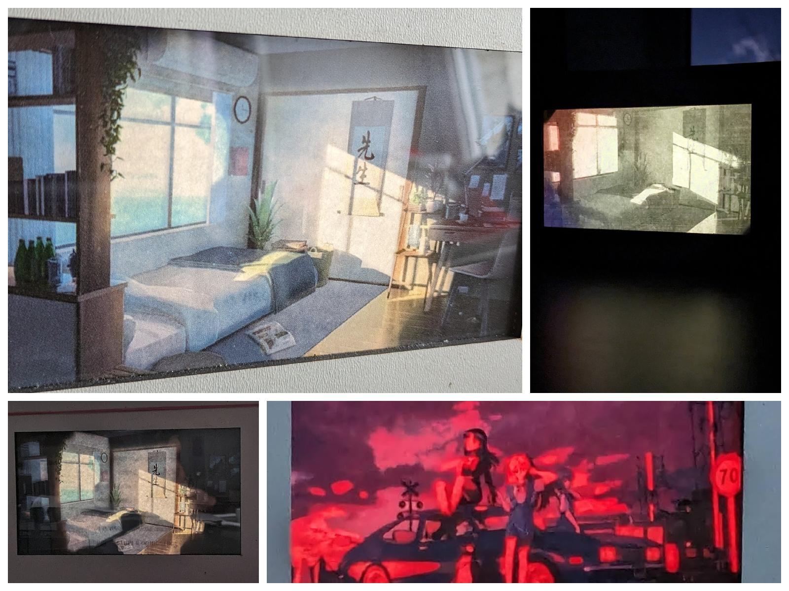
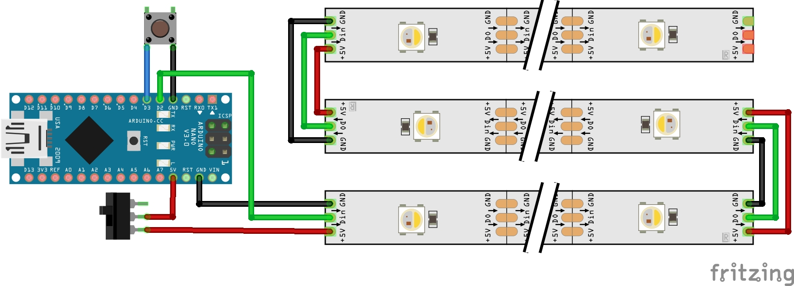

# Image box

A box with luminous images of different brightness levels.



## Button control

- If the light is in **Sleep Timer** mode, pressing the button exits this mode and switches to **Night** mode, restoring the previous brightness.
- If the light is not in **Sleep Timer** mode, pressing the button:
  - In **Day** mode, it switches to **Night** mode, and vice versa.
  - In **Night** mode, it switches to **Day** mode, and vice versa.
  - In brightness and color temperature control modes, it toggles between available settings.
- Double-clicking the button toggles between **Day** and **Night** modes.
- Triple-clicking the button reduces brightness or color temperature.
- Quadruple-clicking the button sets the light to **Sleep Timer** mode and saves the current brightness.
- Holding the button causes changes in brightness or color temperature depending on the mode.

## Setup

- **Setup**

  ```c
  /* === SETUP === */
  #define ROW_COUNT 3
  #define COLUMN_COUNT 8
  #define NUM_LEDS ROW_COUNT *COLUMN_COUNT
  #define DATA_PIN 2
  #define BUTTON_PIN 3
  #define SLEEP_TIMER_DELAY (1000 * 60 20)        // in millis
  #define SLEEP_TIMER_DIM_DURATION (1000 * 60 5)  // in millis
  ```

- **Flikering brightness**

  ```c
  // flickering brightness
  #define FLICKERING_BRIGHTNESS_HALF_PERIOD 1000 * 5  // in millis
  #define FLICKERING_BRIGHTNESS_MAX_DELTA 180
  ```

- **Flikering color temperature**

  Control color temperature with button

  ```c
  // flickering color temperature
  #define FLICKERING_COLOR_TEMPERATURE_HALF_PERIOD 1000 * 60 // in millis
  #define FLICKERING_COLOR_TEMPERATURE_MAX_DELTA 15
  ```

- **Brightness control**

  Control brightness with button

  ```c
  // brightness
  #define BRIGHTNESS_SMALL_STEP 10
  #define BRIGHTNESS_BIG_STEP 50
  #define MAX_BRIGHTNESS 255
  #define MIN_BRIGHTNESS 5
  ```

## Components

- Address LED Strip
- Arduino Nano
- Switch
- Button
- Box (or deep photo frame) with glass or transparent plastic
- Cut-out images

## Scheme



If you want to use a lot of LEDs, you should add additional power.

# Libraries

- [FastLED](https://github.com/FastLED/FastLED)
- [EncButton](https://github.com/GyverLibs/EncButton)
